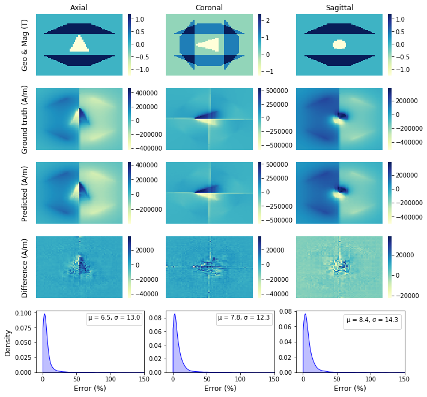

# Deep learning for modelling three dimensional magnetic static field

[](https://opensource.org/licenses/Apache-2.0)

## The following steps can be applied to reproduce the results of this research.

- Download and extract the weights of the deep learning model from https://osf.io/download/rg7fb:

**In linux**
```bash
wget https://osf.io/download/rg7fb
unzip rg7fb
```

The folder contains the weights is "saved_model_nograd" should appear in the current working directory.

**Create new environment and install dependencies using Conda**

```bash
conda env create -f environment.yml
conda activate Obj3D
```

- Reproduce results
```bash
python test.py --component=1 # --component = 0, 1, 2 for axial, azimuthal and radial field components
```

