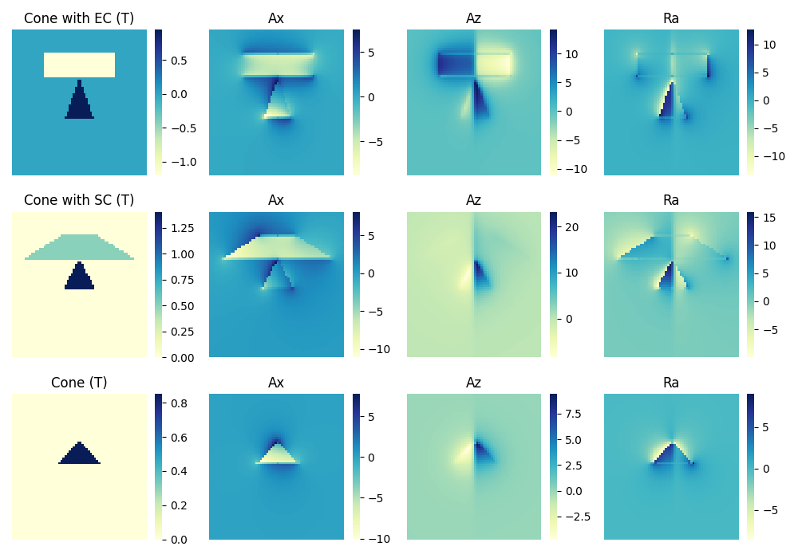
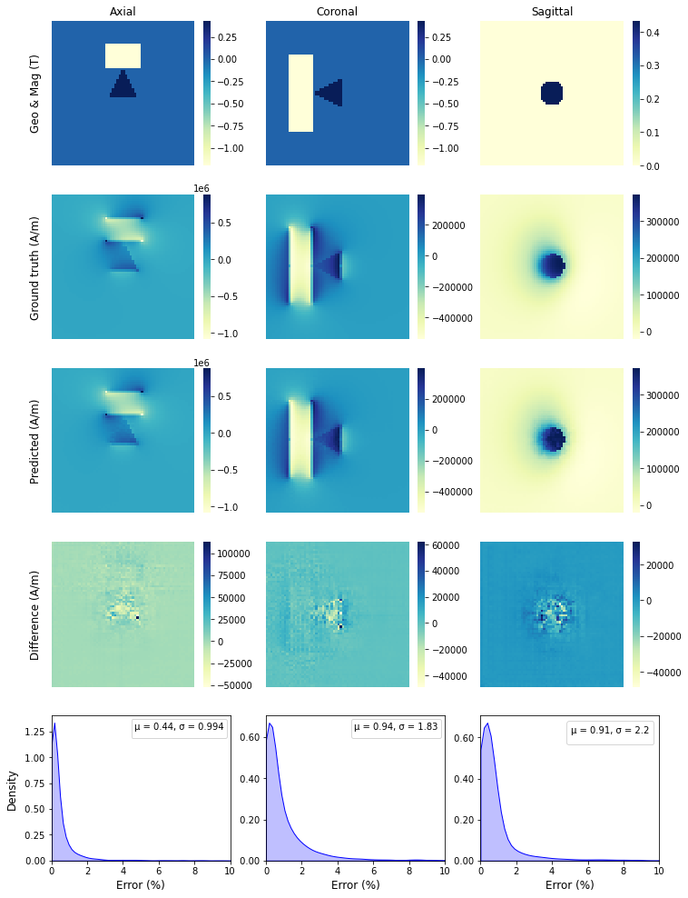

# Deep learning for modelling three dimensional magnetic static field

[](https://opensource.org/licenses/Apache-2.0)

In this work, we use the 3D U-Net (V-Net) to learn the three dimensional magnetic field generated from permanent magnets.


## The following steps can be applied to reproduce the results of this research.

- Download and extract the weights of the deep learning model from https://osf.io/download/qshvw:

**In linux**
```bash
!wget https://osf.io/download/qshvw
!unzip qshvw
```

The folder contains the weights and "saved_model_nograd" should appear in the current working directory.

**Create new environment and install dependencies using Conda**

```bash
conda env create -f environment.yml
conda activate Obj3D
```

- Reproduce results

**Samples of generated data**
```bash
python sample_plot.py
```


**Validation of the predicted and ground truth field**
```bash
python test.py --component=0 # --component = 0, 1, 2 for axial, azimuthal and radial field components
```


